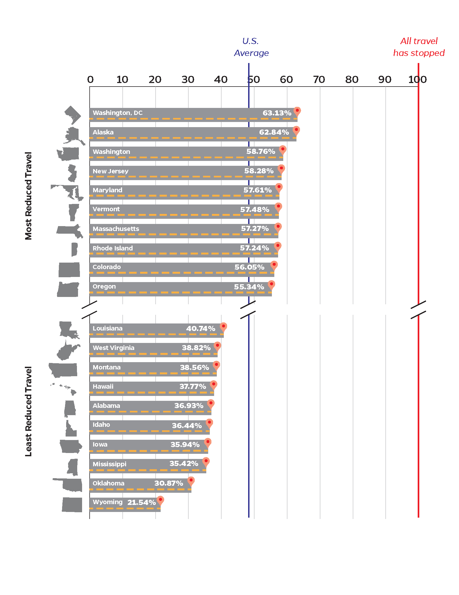
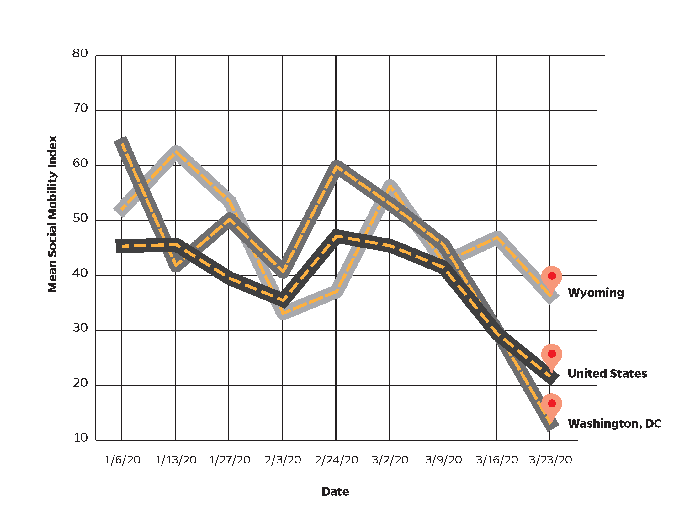

## Computing Mobility
The Twitter Social Mobility Index is a measure of social distancing and travel derived from Twitter data. We use public geolocated Twitter data to measure how much a user travels in a given week.
We compute the standard deviation of Twitter geolocated tweets per week, 
and aggregate the data over an entire population to produce a metric for the US as a whole and for individual states and cities.

You can find a complete description of our method and results [in our paper](paper/twitter_social_mobility.pdf).

## Results
The highlights of our study find that:

* Since the start of social distancing on March 16, 2020 mobility in the United States has dropped 48.77%.
    
* Every US state and territory has reduced mobility, though the variance by state is high.

* States that were early adopters of social distancing practices have larger reductions in travel. The eight states that do not currently (April 5, 2020) have state wide orders rank lower: Arkansas (37), Iowa (50), Nebraska (29), North Dakota (13), South Carolina (34), South Dakota (39), Oklahoma (52), Utah (17),

* The last two weeks of March have the lowest mobility of any week since January 1, 2019.

 
## Mobility Reduction by State
This table shows the Twitter Social Mobility Index measured in kilometers for 
every state and territory in United States, New York City, and United States as a whole. 

|    Location   | Mobility from January 1, 2019 to March 15, 2020 | Mobility in March 16 - March 29, 2020 | Mobility Reduction | Rank |
|:-------------:|:-----------------------------------------------:|:-------------------------------------:|:------------------:|:----:|
|       AK      |                      84.75                      |                 31.49                 |       62.84%       |   2  |
|       AL      |                      37.46                      |                 23.63                 |       36.93%       |  47  |
|       AR      |                      39.19                      |                 22.34                 |       43.00%       |  37  |
|       AZ      |                      47.30                      |                 25.37                 |       46.37%       |  32  |
|       CA      |                      59.47                      |                 28.64                 |       51.84%       |  18  |
|       CO      |                      54.21                      |                 23.82                 |       56.05%       |   9  |
|       CT      |                      34.16                      |                 15.35                 |       55.05%       |  11  |
|       DC      |                      58.45                      |                 21.55                 |       63.13%       |   1  |
|       DE      |                      33.38                      |                 17.39                 |       47.90%       |  28  |
|       FL      |                      59.29                      |                 34.61                 |       41.62%       |  40  |
|       GA      |                      51.43                      |                 29.46                 |       42.73%       |  38  |
|       HI      |                      112.71                     |                 70.14                 |       37.77%       |  46  |
|       IA      |                      38.23                      |                 24.49                 |       35.94%       |  50  |
|       ID      |                      53.61                      |                 34.07                 |       36.44%       |  49  |
|       IL      |                      41.95                      |                 18.97                 |       54.79%       |  12  |
|       IN      |                      34.69                      |                 19.30                 |       44.35%       |  35  |
|       KS      |                      50.44                      |                 23.67                 |       53.07%       |  15  |
|       KY      |                      33.99                      |                 16.48                 |       51.51%       |  20  |
|       LA      |                      36.53                      |                 21.65                 |       40.74%       |  43  |
|       MA      |                      43.50                      |                 18.59                 |       57.27%       |   7  |
|       MD      |                      34.94                      |                 14.81                 |       57.61%       |   5  |
|       ME      |                      46.42                      |                 27.19                 |       41.42%       |  42  |
|       MI      |                      42.79                      |                 22.12                 |       48.31%       |  26  |
|       MN      |                      47.75                      |                 23.23                 |       51.35%       |  21  |
|       MO      |                      39.89                      |                 20.49                 |       48.64%       |  24  |
|       MS      |                      39.63                      |                 25.59                 |       35.42%       |  51  |
|       MT      |                      52.46                      |                 32.23                 |       38.56%       |  45  |
|       NC      |                      39.89                      |                 20.32                 |       49.06%       |  23  |
|       ND      |                      48.94                      |                 22.50                 |       54.02%       |  13  |
|       NE      |                      40.66                      |                 21.26                 |       47.73%       |  29  |
|       NH      |                      41.97                      |                 21.66                 |       48.38%       |  25  |
|       NJ      |                      37.23                      |                 15.54                 |       58.28%       |   4  |
|       NM      |                      44.87                      |                 25.54                 |       43.08%       |  36  |
|       NV      |                      62.72                      |                 34.33                 |       45.26%       |  33  |
|       NY      |                      53.32                      |                 25.73                 |       51.75%       |  19  |
|       OH      |                      34.22                      |                 16.70                 |       51.19%       |  22  |
|       OK      |                      40.44                      |                 27.96                 |       30.87%       |  52  |
|       OR      |                      53.96                      |                 24.10                 |       55.34%       |  10  |
|       PA      |                      42.14                      |                 19.54                 |       53.62%       |  14  |
|       PR      |                      35.30                      |                 20.63                 |       41.55%       |  41  |
|       RI      |                      34.36                      |                 14.69                 |       57.24%       |   8  |
|       SC      |                      36.78                      |                 20.16                 |       45.18%       |  34  |
|       SD      |                      49.80                      |                 28.82                 |       42.12%       |  39  |
|       TN      |                      42.64                      |                 22.42                 |       47.42%       |  30  |
|       TX      |                      56.00                      |                 29.09                 |       48.05%       |  27  |
|       UT      |                      50.62                      |                 24.29                 |       52.01%       |  17  |
|       VA      |                      44.22                      |                 20.83                 |       52.89%       |  16  |
|       VI      |                      100.91                     |                 63.86                 |       36.72%       |  48  |
|       VT      |                      41.19                      |                 17.51                 |       57.48%       |   6  |
|       WA      |                      55.74                      |                 22.99                 |       58.76%       |   3  |
|       WI      |                      42.78                      |                 22.83                 |       46.63%       |  31  |
|       WV      |                      36.25                      |                 22.18                 |       38.82%       |  44  |
|       WY      |                      53.10                      |                 41.66                 |       21.54%       |  53  |
| United States |                      49.81                      |                 25.52                 |       48.77%       |  -   |
| New York City |                      63.98                      |                 31.25                 |       51.16%       |  -   |

Here is a visualization of the table.

This figure shows the weekly social mobility index for Washington, DC (1), Wycoming (53) and the United States 
since January 6, 2020.

